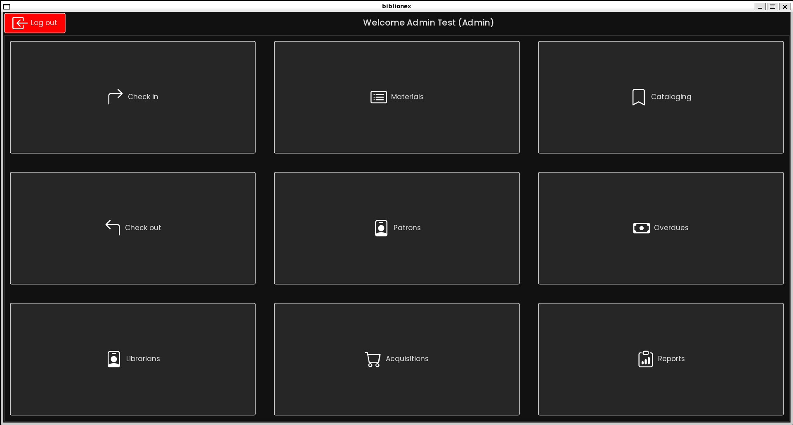

# 📚 Biblionex 

Biblionex is a desktop application designed to facilitate the management of library resources and provide a seamless experience for both patrons and librarians. It features robust search capabilities, user account management, inventory control, and various other tools to enhance the overall efficiency of library operations. For more details on the project, see our [System Design Document (SDD)](docs/biblionex-sdd.pdf).

|                                                          |                                                                  |
| -------------------------------------------------------- | ---------------------------------------------------------------- |
|                     |  |
|   |             |
|         |              |
|  |           |
|                        |

## Tools & Technologies

- Programming Language: Java
- Libraries: FlatLaf, Bootstrap Icons
- Other Technologies: MySQL, Maven

## Main features

- Model-View-Controller (MVC) Architecture: The project is structured using the MVC pattern to separate concerns and promote maintainability.
- Observer Pattern: Implemented to allow objects to notify other objects about state changes, ensuring low coupling and flexibility.
- UML Diagrams: Detailed UML diagrams (class diagrams, sequence diagrams, etc.) were created to document the system's architecture and interaction flows.
- Authentication system with password hashing.
- Email-based password reset.
- Search mechanism with fuzzy searching.
- User management.
- Inventory and stock management.
- Cataloging and material management.
- Check-In and check-out management.

## Installation

Follow instructions from the [installation guide](docs/INSTALLATION_GUIDE.md) and then follow instructions in the [usage guide](docs/USAGE_GUIDE.md) to run the project.

## Disclaimer

This project was developed as part of an educational assignment and is not production-ready. Please note that the project is currently incomplete, and no further development is planned.

