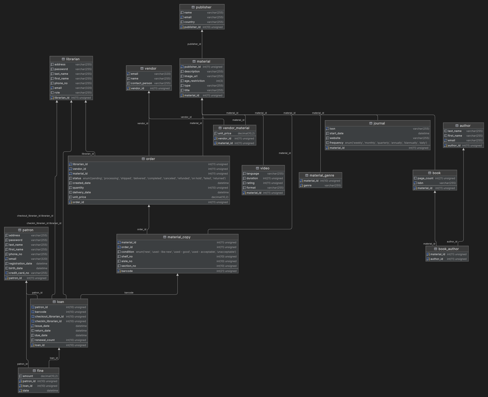

# Database Design

- [Database Design](#database-design)
- [Tables](#tables)
  - [author](#author)
  - [book](#book)
  - [book\_author](#book_author)
  - [book\_genre](#book_genre)
  - [fine](#fine)
  - [journal](#journal)
  - [journal\_scope](#journal_scope)
  - [librarian](#librarian)
  - [loan](#loan)
  - [material](#material)
  - [material\_copy](#material_copy)
  - [order](#order)
  - [patron](#patron)
  - [publisher](#publisher)
  - [vendor](#vendor)
  - [vendor\_material](#vendor_material)
  - [video](#video)
  - [video\_genre](#video_genre)

# Tables

## author

| Attribute  | Description                      | Data Type        | Constraints                 |
| ---------- | -------------------------------- | ---------------- | --------------------------- |
| author_id  | Unique identifier for the author | int(11) unsigned | AUTO_INCREMENT, PRIMARY KEY |
| last_name  | Last name of the author          | varchar(255)     | DEFAULT NULL                |
| first_name | First name of the author         | varchar(255)     | DEFAULT NULL                |
| email      | Email address of the author      | varchar(255)     | NOT NULL, UNIQUE KEY        |

## book             

| Attribute   | Description                        | Data Type        | Constraints           |
| ----------- | ---------------------------------- | ---------------- | --------------------- |
| material_id | Unique identifier for the book     | int(11) unsigned | NOT NULL, PRIMARY KEY |
| page_count  | Number of pages in the book        | int(21) unsigned | DEFAULT NULL          |
| isbn        | International Standard Book Number | varchar(255)     | NOT NULL, UNIQUE KEY  |

## book_author      
 
| Attribute   | Description                                       | Data Type        | Constraints                          |
| ----------- | ------------------------------------------------- | ---------------- | ------------------------------------ |
| material_id | Foreign key referencing book's material_id        | int(11) unsigned | NOT NULL                             |
| author_id   | Foreign key referencing author's author_id        | int(11) unsigned | NOT NULL                             |
|             | Composite primary key referencing book and author |                  | PRIMARY KEY (material_id, author_id) |

## book_genre       

| Attribute   | Description                                      | Data Type        | Constraints                      |
| ----------- | ------------------------------------------------ | ---------------- | -------------------------------- |
| material_id | Foreign key referencing book's material_id       | int(11) unsigned | NOT NULL                         |
| genre       | Genre of the book                                | varchar(255)     | NOT NULL                         |
|             | Composite primary key referencing book and genre |                  | PRIMARY KEY (material_id, genre) |

## fine       

| Attribute | Description                                       | Data Type        | Constraints                      |
| --------- | ------------------------------------------------- | ---------------- | -------------------------------- |
| patron_id | Foreign key referencing patron's patron_id        | int(11) unsigned | NOT NULL                         |
| loan_id   | Foreign key referencing loan's loan_id            | int(11) unsigned | NOT NULL                         |
| date      | Date of the fine                                  | datetime         | NOT NULL                         |
| amount    | Amount of the fine                                | decimal(10,2)    | NOT NULL                         |
|           | Composite primary key referencing patron and loan |                  | PRIMARY KEY (patron_id, loan_id) |

## journal          

| Attribute   | Description                          | Data Type        | Constraints                                            |
| ----------- | ------------------------------------ | ---------------- | ------------------------------------------------------ |
| material_id | Unique identifier for the journal    | int(11) unsigned | NOT NULL, PRIMARY KEY                                  |
| issn        | International Standard Serial Number | varchar(255)     | NOT NULL, UNIQUE KEY                                   |
| start_date  | Start date of the journal            | datetime         | NOT NULL                                               |
| website     | Website of the journal               | varchar(255)     | NOT NULL                                               |
| frequency   | Frequency of publication             | enum             | DEFAULT NULL, CHECK ('weekly', 'monthly', 'quarterly', |
|             |                                      |                  | 'annually', 'biannually', 'daily')                     |

## journal_scope    

| Attribute   | Description                                         | Data Type        | Constraints                      |
| ----------- | --------------------------------------------------- | ---------------- | -------------------------------- |
| material_id | Foreign key referencing journal's material_id       | int(11) unsigned | NOT NULL                         |
| scope       | Scope of the journal                                | varchar(255)     | NOT NULL                         |
|             | Composite primary key referencing journal and scope |                  | PRIMARY KEY (material_id, scope) |

## librarian        

| Attribute    | Description                         | Data Type        | Constraints                 |
| ------------ | ----------------------------------- | ---------------- | --------------------------- |
| librarian_id | Unique identifier for the librarian | int(11) unsigned | AUTO_INCREMENT, PRIMARY KEY |
| address      | Address of the librarian            | varchar(255)     | DEFAULT NULL                |
| password     | Password of the librarian           | varchar(255)     | DEFAULT NULL                |
| last_name    | Last name of the librarian          | varchar(255)     | DEFAULT NULL                |
| first_name   | First name of the librarian         | varchar(255)     | DEFAULT NULL                |
| phone_no     | Phone number of the librarian       | varchar(255)     | NOT NULL                    |
| email        | Email address of the librarian      | varchar(320)     | NOT NULL, UNIQUE KEY        |

## loan          
  
| Attribute     | Description                                | Data Type        | Constraints                 |
| ------------- | ------------------------------------------ | ---------------- | --------------------------- |
| loan_id       | Unique identifier for the loan             | int(11) unsigned | AUTO_INCREMENT, PRIMARY KEY |
| patron_id     | Foreign key referencing patron's patron_id | int(11) unsigned | NOT NULL                    |
| barcode       | Barcode of the loaned material             | int(21) unsigned | NOT NULL                    |
| issue_date    | Date of issuing the loan                   | datetime         | NOT NULL                    |
| return_date   | Date of returning the loan (nullable)      | datetime         | DEFAULT NULL                |
| due_date      | Due date of the loan                       | datetime         | NOT NULL                    |
| renewal_count | Count of renewals for the loan             | int(11)          | DEFAULT NULL                |
|               | Composite unique key referencing patron,   |                  | UNIQUE KEY (patron_id,      |
|               | barcode, and issue_date                    |                  | barcode, issue_date)        |

## material         

| Attribute       | Description                                      | Data Type        | Constraints                 |
| --------------- | ------------------------------------------------ | ---------------- | --------------------------- |
| material_id     | Unique identifier for the material               | int(11) unsigned | AUTO_INCREMENT, PRIMARY KEY |
| publisher_id    | Foreign key referencing publisher's publisher_id | int(11) unsigned | NOT NULL                    |
| description     | Description of the material                      | varchar(255)     | NOT NULL                    |
| image_url       | URL of the image of the material                 | varchar(255)     | NOT NULL                    |
| age_restriction | Age restriction for accessing the material       | int(3)           | NOT NULL DEFAULT 0          |
| type            | Type of the material                             | varchar(255)     | NOT NULL,                   |
| title           | Title of the material                            | varchar(255)     | NOT NULL                    |

## material_copy    

| Attribute   | Description                                    | Data Type        | Constraints                 |
| ----------- | ---------------------------------------------- | ---------------- | --------------------------- |
| barcode     | Unique identifier for the material copy        | int(21) unsigned | AUTO_INCREMENT, PRIMARY KEY |
| material_id | Foreign key referencing material's material_id | int(11) unsigned | NOT NULL                    |
| order_id    | Foreign key referencing order's order_id       | int(11) unsigned | NOT NULL                    |
| condition   | Condition of the material copy                 | varchar(255)     | DEFAULT NULL                |
| shelf_no    | Shelf number of the material copy              | int(11)          | NOT NULL                    |
| aisle_no    | Aisle number of the material copy              | int(11)          | NOT NULL                    |
| section_no  | Section number of the material copy            | int(11)          | NOT NULL                    |

## order            

| Attribute     | Description                                      | Data Type        | Constraints                            |
| ------------- | ------------------------------------------------ | ---------------- | -------------------------------------- |
| order_id      | Unique identifier for the order                  | int(11) unsigned | AUTO_INCREMENT, PRIMARY KEY            |
| librarian_id  | Foreign key referencing librarian's librarian_id | int(11) unsigned | NOT NULL                               |
| vendor_id     | Foreign key referencing vendor's vendor_id       | int(11) unsigned | NOT NULL                               |
| material_id   | Foreign key referencing material's material_id   | int(11) unsigned | NOT NULL                               |
| status        | Status of the order (e.g., pending, fulfilled)   | varchar(255)     | NOT NULL DEFAULT 'pending'             |
| created_date  | Date of the order creation                       | datetime         | NOT NULL                               |
| quantity      | Quantity of material in the order                | int(11)          | NOT NULL                               |
| delivery_date | Date of delivery of the order (nullable)         | datetime         | DEFAULT NULL                           |
| unit_price    | Price per unit of the material                   | decimal(10,2)    | NOT NULL                               |
|               | Composite unique key referencing librarian,      |                  | UNIQUE KEY (librarian_id, material_id, |
|               | material, vendor, and created_date               |                  | vendor_id, created_date)               |

## patron           

| Attribute         | Description                                     | Data Type        | Constraints                 |
| ----------------- | ----------------------------------------------- | ---------------- | --------------------------- |
| patron_id         | Unique identifier for the patron                | int(11) unsigned | AUTO_INCREMENT, PRIMARY KEY |
| address           | Address of the patron                           | varchar(255)     | DEFAULT NULL                |
| password          | Password of the patron                          | varchar(255)     | DEFAULT NULL                |
| last_name         | Last name of the patron                         | varchar(255)     | DEFAULT NULL                |
| first_name        | First name of the patron                        | varchar(255)     | DEFAULT NULL                |
| phone_no          | Phone number of the patron                      | varchar(255)     | NOT NULL                    |
| email             | Email address of the patron (unique identifier) | varchar(320)     | NOT NULL, UNIQUE KEY        |
| registration_date | Date of registration of the patron              | datetime         | NOT NULL                    |
| birth_date        | Date of birth of the patron (nullable)          | datetime         | DEFAULT NULL                |
| card_no           | Card number of the patron (unique identifier)   | varchar(255)     | NOT NULL, UNIQUE KEY        |

## publisher        

| Attribute    | Description                         | Data Type        | Constraints                 |
| ------------ | ----------------------------------- | ---------------- | --------------------------- |
| publisher_id | Unique identifier for the publisher | int(10) unsigned | AUTO_INCREMENT, PRIMARY KEY |
| name         | Name of the publisher               | varchar(255)     | DEFAULT NULL                |
| email        | Email address of the publisher      | varchar(255)     | NOT NULL, UNIQUE KEY        |
| country      | Country of the publisher            | varchar(255)     | DEFAULT NULL                |

## vendor           

| Attribute      | Description                                     | Data Type        | Constraints                 |
| -------------- | ----------------------------------------------- | ---------------- | --------------------------- |
| vendor_id      | Unique identifier for the vendor                | int(11) unsigned | AUTO_INCREMENT, PRIMARY KEY |
| email          | Email address of the vendor (unique identifier) | varchar(320)     | NOT NULL, UNIQUE KEY        |
| name           | Name of the vendor                              | varchar(255)     | NOT NULL                    |
| contact_person | Contact person of the vendor                    | varchar(255)     | NOT NULL                    |

## vendor_material  

| Attribute   | Description                                           | Data Type        | Constraints                          |
| ----------- | ----------------------------------------------------- | ---------------- | ------------------------------------ |
| vendor_id   | Foreign key referencing vendor's vendor_id            | int(11) unsigned | NOT NULL                             |
| material_id | Foreign key referencing material's material_id        | int(11) unsigned | NOT NULL                             |
| unit_price  | Price per unit of the material for the vendor         | decimal(10,2)    | NOT NULL                             |
|             | Composite primary key referencing vendor and material |                  | PRIMARY KEY (vendor_id, material_id) |

## video            

| Attribute   | Description                             | Data Type        | Constraints                                                  |
| ----------- | --------------------------------------- | ---------------- | ------------------------------------------------------------ |
| material_id | Unique identifier for the video         | int(11) unsigned | NOT NULL, PRIMARY KEY                                        |
| language    | Language of the video                   | varchar(255)     | NOT NULL                                                     |
| duration    | Duration of the video (in seconds)      | int(21) unsigned | NOT NULL                                                     |
| rating      | Rating of the video (1 to 5)            | int(11) unsigned | NOT NULL                                                     |
| format      | Format of the video (e.g., MP4, AVI)    | varchar(255)     | NOT NULL                                                     |
|             | Check constraint for valid format       |                  | MUST END WITH `.MP4`, `.AVI`, `.MOV`, `.MKV`, `.FLV`,`.MPEG` |
|             | Check constraint for valid rating range |                  | CHECK ('rating' >= 1 and 'rating' <= 5)                      |

## video_genre      

| Attribute   | Description                                       | Data Type        | Constraints                      |
| ----------- | ------------------------------------------------- | ---------------- | -------------------------------- |
| material_id | Foreign key referencing video's material_id       | int(11) unsigned | NOT NULL                         |
| genre       | Genre of the video                                | varchar(255)     | NOT NULL                         |
|             | Composite primary key referencing video and genre |                  | PRIMARY KEY (material_id, genre) |
